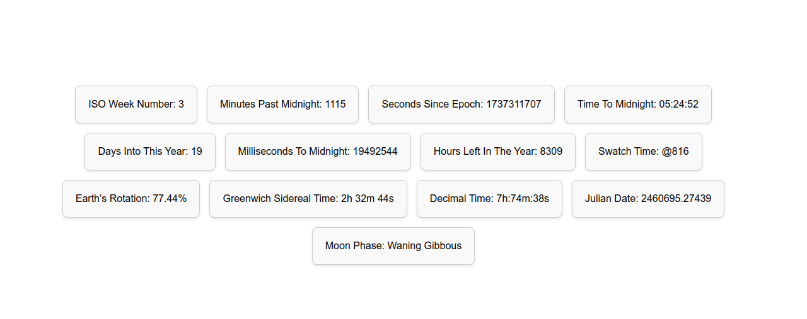

# Bad Clock

This project displays various interesting time-related metrics, such as the number of minutes past midnight, the current ISO week number, the number of seconds since the Unix epoch, and more. The clock updates every second, providing a real-time view of these metrics.

## Features
- **Minutes Past Midnight**: Displays the number of minutes that have passed since midnight of the current day.
- **Week Number**: Displays the current ISO week number for the year.
- **Seconds Since Epoch**: Shows the number of seconds that have passed since the Unix epoch (1 January 1970).
- **Reverse Time**: Displays the time remaining until midnight, updating every second.
- **Day Counter**: Displays how many days have passed so far in the current year.

## Files
- **index.html**: Contains the basic structure of the webpage, including placeholders for each time-related metric.
- **style.css**: Provides the styling for the webpage, including layout, colors, fonts, and other visual elements to make the clock display aesthetically pleasing.
- **script.js**: Contains the JavaScript logic to calculate and update each of the time metrics every second.

## Technologies Used
- **HTML5**: For the basic structure of the webpage.
- **CSS3**: To style the page, center the clock, and apply visual enhancements.
- **JavaScript**: To calculate the current time and update all metrics in real-time.

## Future Improvements
- Add additional metrics such as the total hours left in the year or moon phase information.

## Screenshot

## License
This project is open-source and available under the MIT License.

